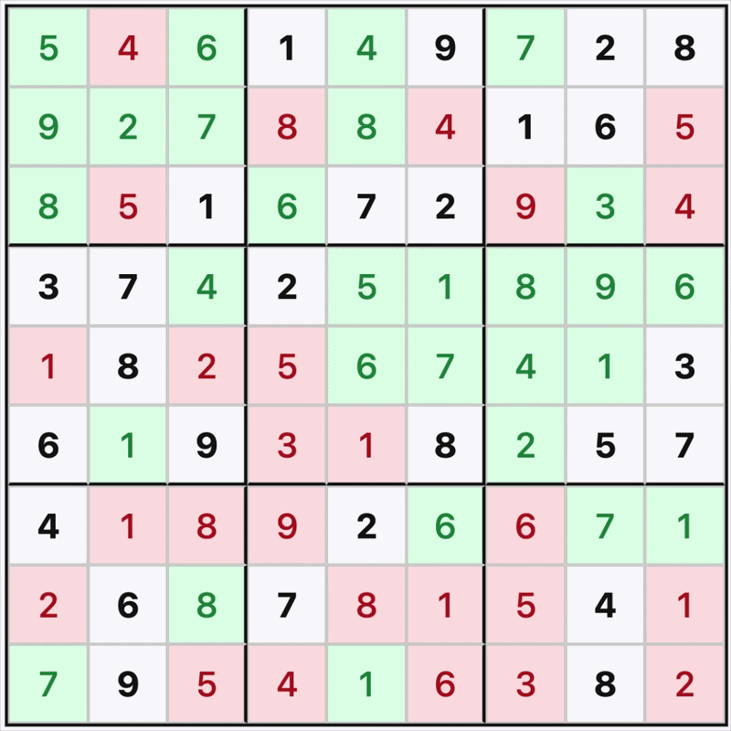
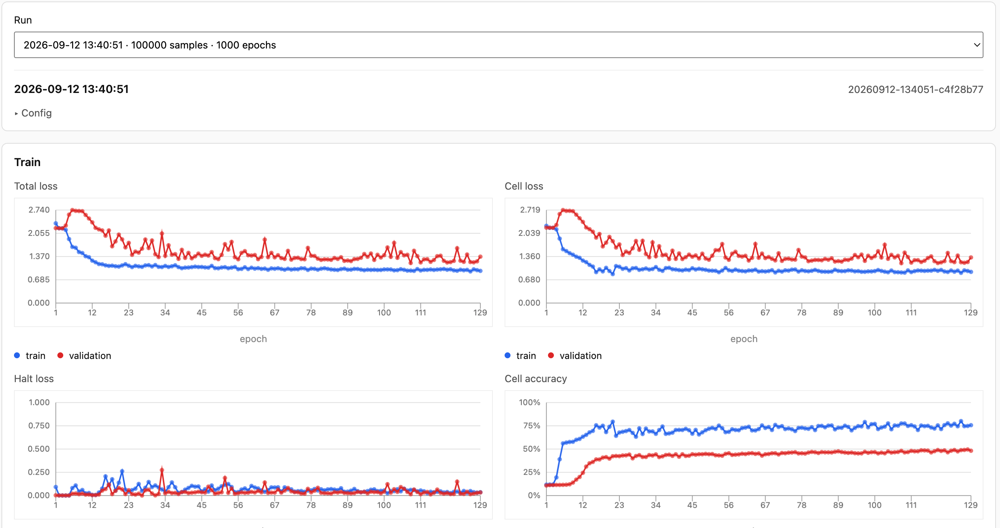
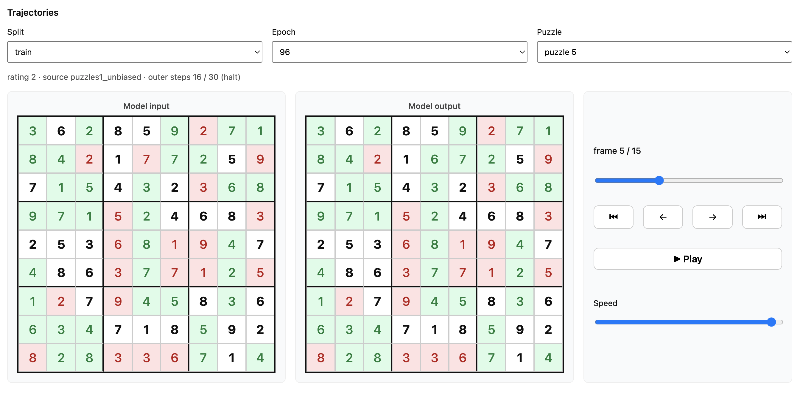

# Discrete Reasoning

**Looped MLP-Mixer** sudoku solver with an outer commit loop, inner mixer iterations, and a learned halt head, trained from scratch on [sapientinc/sudoku-extreme](https://huggingface.co/datasets/sapientinc/sudoku-extreme).



## Getting started

[docs/getting-started.md](docs/getting-started.md)

Install with `uv sync`, download the dataset (~798 MB), train, and open the local viz server. Minimal path:

```bash
uv sync
uv run download-dataset
uv run train \
  --min-rating 0 --max-rating 0 \
  --max-samples 100 --epochs 30 \
  --dim 512 --num-blocks 2 \
  --inner-iters 5 --train-max-outer-iters 10 \
  --eval-max-outer-iters 10 \
  --train-batch-size 8 --batches-per-epoch 100
uv run python -m http.server 8000
```

Open [http://localhost:8000/viz/](http://localhost:8000/viz/). Serve from the **repo root**.

## Method

[docs/method.md](docs/method.md)

Shared MLP-Mixer stack reused across an outer commit loop: each outer step applies the previous prediction, runs inner mixer iterations on encoded grid state, and updates detached cell memory. A halt head learns when the grid matches the solution. Training uses parallel puzzle slots with optional augmentations and partial ground-truth reveal.

## CLI

[docs/cli.md](docs/cli.md)

Entry points: `download-dataset`, `train`, `eval`, `resume`. Eval supports test-time restarts and one-dimensional compute sweeps (inner steps, outer commits, tries). PyTorch profiler hooks are available on `train`.

## Runs & viz

[docs/runs.md](docs/runs.md)

Each run writes `history.json`, checkpoints, and per-puzzle trajectory JSON under `runs/<run-id>/`. The viz page charts train/val metrics and plays back outer-commit trajectories.

Train and validation metrics per epoch: loss, cell/puzzle accuracy, halt rate, and accuracy by rating group.

<p align="center">
  
</p>

Trajectory player for one puzzle: model input and output at each outer commit until halt or max steps.

<p align="center">
  
</p>

## Jetson

[jetson/README.md](jetson/README.md)

Docker setup for training and eval on NVIDIA Jetson (JetPack). Source is bind-mounted; rebuild only when dependencies change.

<p align="center">
  
</p>

## References

- Dataset: [sapientinc/sudoku-extreme](https://huggingface.co/datasets/sapientinc/sudoku-extreme) on Hugging Face
- [Hierarchical Reasoning Model (HRM)](https://arxiv.org/abs/2506.21734)
- [Less is More: Recursive Reasoning with Tiny Networks (TRM)](https://arxiv.org/abs/2510.04871)
- [Looped Transformers are Better at Learning Learning Algorithms](https://arxiv.org/abs/2311.12424)
- [Diffusion as a Training Curriculum for Timestep-Free Iterative Reasoning](https://arxiv.org/abs/2609.01449)
- [Flow Reasoning Models: Turning Flows Into Efficient Recurrent Reasoners](https://arxiv.org/abs/2606.29150)

MIT License.
